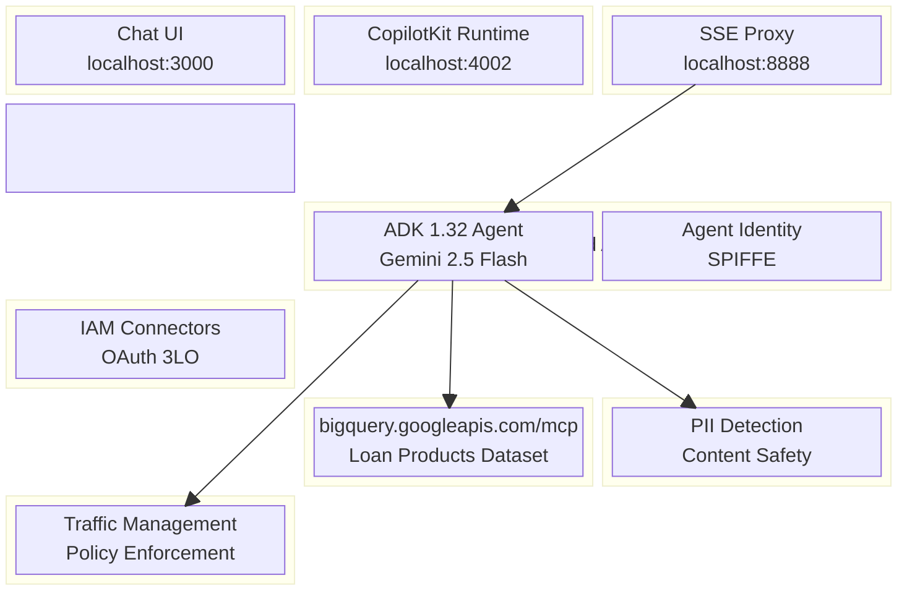

# Acme Financial Services — Loan Advisor Agent

An end-to-end Agent Governance demo on Google Cloud, showcasing how enterprises can deploy AI agents with full security, identity, and data governance controls.

## Architecture



```
┌──────────────┐     ┌─────────────────┐     ┌──────────────────┐
│  React Chat  │────▸│ CopilotKit      │────▸│ AG-UI Backend    │
│  (3000)      │     │ Runtime (4002)  │     │ FastAPI (8888)   │
└──────────────┘     └─────────────────┘     └────────┬─────────┘
                                                      │ SSE Stream
                                              ┌───────▼──────────┐
                                              │  Agent Engine     │
                                              │  ADK 1.32 Agent   │
                                              │  Gemini 2.5 Flash │
                                              └──┬─────┬──────┬──┘
                                                 │     │      │
                              ┌──────────────────┘     │      └──────────────────┐
                              ▼                        ▼                         ▼
                    ┌──────────────────┐   ┌────────────────────┐   ┌────────────────────┐
                    │ Agent Identity   │   │ BigQuery MCP       │   │ Model Armor        │
                    │ SPIFFE + OAuth   │   │ User's Delegated   │   │ PII Detection      │
                    │ IAM Connectors   │   │ Credentials        │   │ Content Safety     │
                    └──────────────────┘   └────────────────────┘   └────────────────────┘
```

## Governance Features

| Feature | What It Does | Status |
|---------|-------------|--------|
| **Agent Identity** | SPIFFE-based identity for the agent. Authenticates to IAM connectors for OAuth 3LO credential management. | Active |
| **Auth Manager** | Manages user OAuth tokens via IAM connectors. Agent requests consent, user authenticates with Google, tokens stored in a Google-managed vault. | Active |
| **BigQuery MCP** | Agent queries BigQuery using the user's own delegated OAuth token — not a service account. Data access follows the user's permissions. | Active |
| **Model Armor** | Scans agent inputs/outputs for PII, hate speech, and unsafe content at the Agent Gateway level. | Preview |
| **Agent Registry** | Registers the agent as an A2A-discoverable service with capability metadata. | Preview |
| **Agent Gateway** | Manages traffic, enforces policies, and routes requests to agent backends. | Preview |

## Demo Scenario

**Acme Financial Services** is deploying a Loan Advisor AI agent. The enterprise security team requires:

1. **The agent must have its own identity** — not run as a service account or developer credential.
2. **User data access must be delegated** — the agent accesses BigQuery with the user's own permissions, not elevated service credentials.
3. **PII must never leak** — Model Armor intercepts responses containing SSNs, account numbers, or other sensitive data.
4. **All agent activity is auditable** — Agent Identity + Cloud Logging provides a full audit trail.

### Demo Flow

1. User opens the chat UI and asks: *"Show all loan applications"*
2. Agent calls `query_bigquery` tool — Agent Identity detects no credential for this user
3. Agent returns an OAuth consent link — user clicks and authenticates with Google
4. IAM connector stores the OAuth token in a Google-managed credential vault
5. User repeats the request — agent retrieves the stored credential via Agent Identity
6. Agent queries BigQuery MCP server using the user's delegated token
7. BigQuery returns loan application data scoped to the user's permissions
8. Agent formats and presents the results in the chat

## Project Structure

```
loan-advisor-demo/
├── app/
│   ├── agent.py                # ADK agent — tools, auth config, Gemini model
│   ├── agent_runtime_app.py    # Agent Engine entry point (AdkApp wrapper)
│   ├── requirements.txt        # Cloud deploy dependencies
│   └── app_utils/              # Telemetry, typing helpers
├── deploy.py                   # Python SDK deploy script (Agent Identity)
├── ui/
│   ├── frontend/               # React + CopilotKit chat UI
│   ├── runtime/                # CopilotKit Node.js runtime bridge
│   └── backend/                # AG-UI FastAPI proxy to Agent Engine
├── mcp_server/                 # Custom MCP server (loan tools)
└── .env                        # Environment configuration
```

## Prerequisites

- **Google Cloud project** with Vertex AI, IAM Connector Credentials, and BigQuery APIs enabled
- **uv** — Python package manager ([install](https://docs.astral.sh/uv/getting-started/installation/))
- **Node.js 18+** — for the frontend and runtime
- **gcloud CLI** — authenticated with project access

### Google Cloud Setup

```bash
# Set project
gcloud config set project <PROJECT_ID>

# Enable APIs
gcloud services enable aiplatform.googleapis.com \
  iamconnectorcredentials.googleapis.com \
  bigquery.googleapis.com

# Create IAM connectors for OAuth (BigQuery + Gmail)
gcloud alpha agent-identity connectors create adk-agentruntime-bigquery \
  --project=<PROJECT_ID> --location=us-central1 \
  --oauth-client-id=<CLIENT_ID> --oauth-client-secret=<CLIENT_SECRET>

gcloud alpha agent-identity connectors create adk-agentruntime-gmail \
  --project=<PROJECT_ID> --location=us-central1 \
  --oauth-client-id=<CLIENT_ID> --oauth-client-secret=<CLIENT_SECRET>
```

## Quick Start

### 1. Configure environment

```bash
cp .env.example .env
# Edit .env with your project ID, connector names, etc.
```

### 2. Deploy the agent to Agent Engine

```bash
uv run python deploy.py
```

This deploys with `identity_type=AGENT_IDENTITY`, provisioning a SPIFFE identity for the agent.

### 3. Grant IAM permissions

```bash
# Get the agent identity from deploy output, then:
AGENT_IDENTITY="principal://agents.global.org-<ORG_ID>.system.id.goog/resources/..."

# Grant connector access
gcloud alpha agent-identity connectors add-iam-policy-binding adk-agentruntime-bigquery \
  --project=<PROJECT_ID> --location=us-central1 \
  --role=roles/iamconnectors.user --member="$AGENT_IDENTITY"
```

### 4. Start the UI stack

```bash
# Terminal 1 — AG-UI Backend
cd ui/backend && uv run uvicorn src.server.app:create_app --factory --port 8888

# Terminal 2 — CopilotKit Runtime
cd ui/runtime && npm install && npm start

# Terminal 3 — React Frontend
cd ui/frontend && npm install && npm start
```

### 5. Open the demo

Navigate to http://localhost:3000

## Key Technical Decisions

| Decision | Rationale |
|----------|-----------|
| ADK 1.32.0 (not 2.0.0) | ADK 2.0.0 has an `asyncio.run()` event loop bug on Agent Engine ([#2428](https://github.com/google/adk-python/issues/2428)) |
| Plain `AdkApp` (no subclass) | Custom `set_up()` with `vertexai.init()` creates stale event loop references |
| Python SDK deploy (not agents-cli) | More control over `identity_type`, `env_vars`, and `extra_packages` |
| Full scope URLs in auth config | IAM connector does exact scope matching — `email` != `userinfo.email` |
| Cookie-based consent nonce | Survives browser redirects through the OAuth flow reliably |
| AG-UI SSE streaming | Proper NDJSON streaming from Agent Engine via `client.stream()` |

## Troubleshooting

| Symptom | Cause | Fix |
|---------|-------|-----|
| "Event loop is closed" on Agent Engine | ADK 2.0.0 bug | Use ADK 1.32.0 |
| Agent keeps asking for OAuth consent | Scope mismatch in `GcpAuthProviderScheme` | Use full scope URLs (`userinfo.email` not `email`) |
| SSL "Context already used" errors | pyopenssl injected by Agent Engine | Add `urllib3.contrib.pyopenssl.extract_from_urllib3()` |
| "Failed to retrieve consent based credential" | Service account lacks connector access | Grant `roles/iamconnectors.user` to both agent identity AND service account |
| BQ query returns empty | User lacks dataset access | Grant `bigquery.user` role + dataset READER |
| Finalize returns `{}` | Normal — empty body means success | No action needed |
